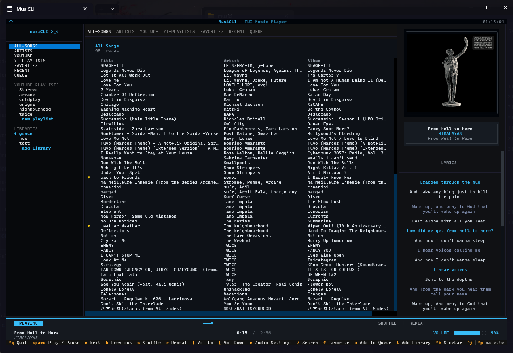
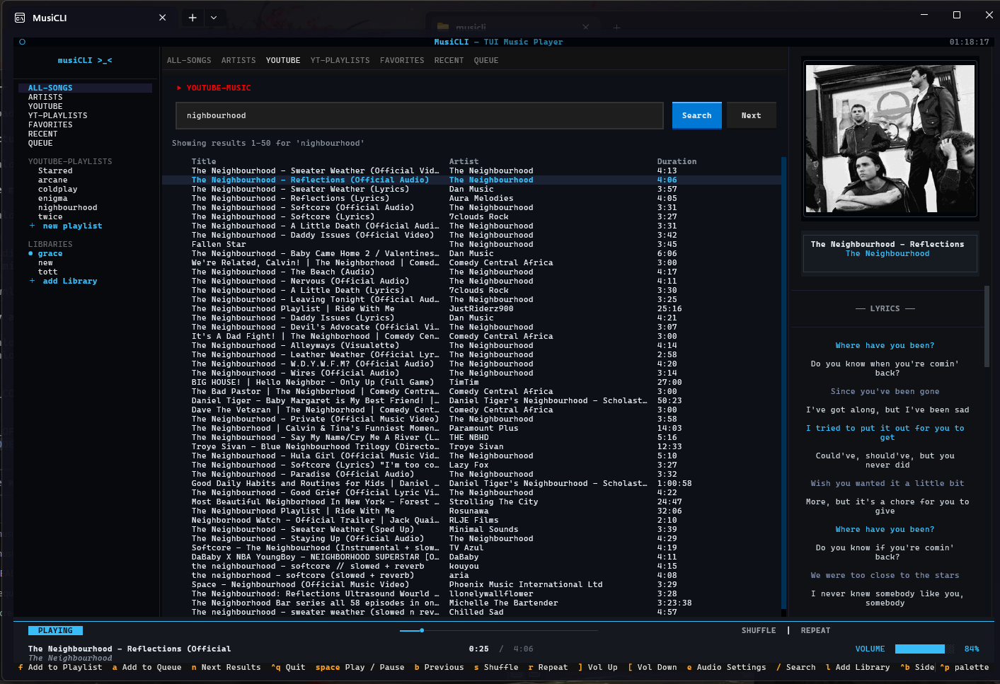
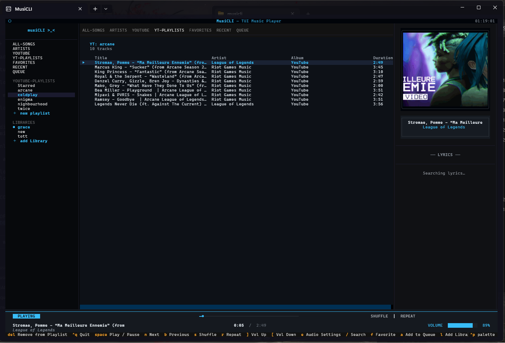
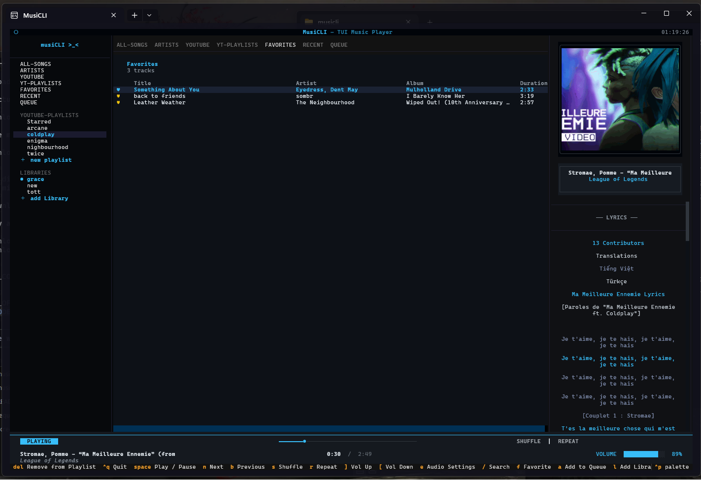
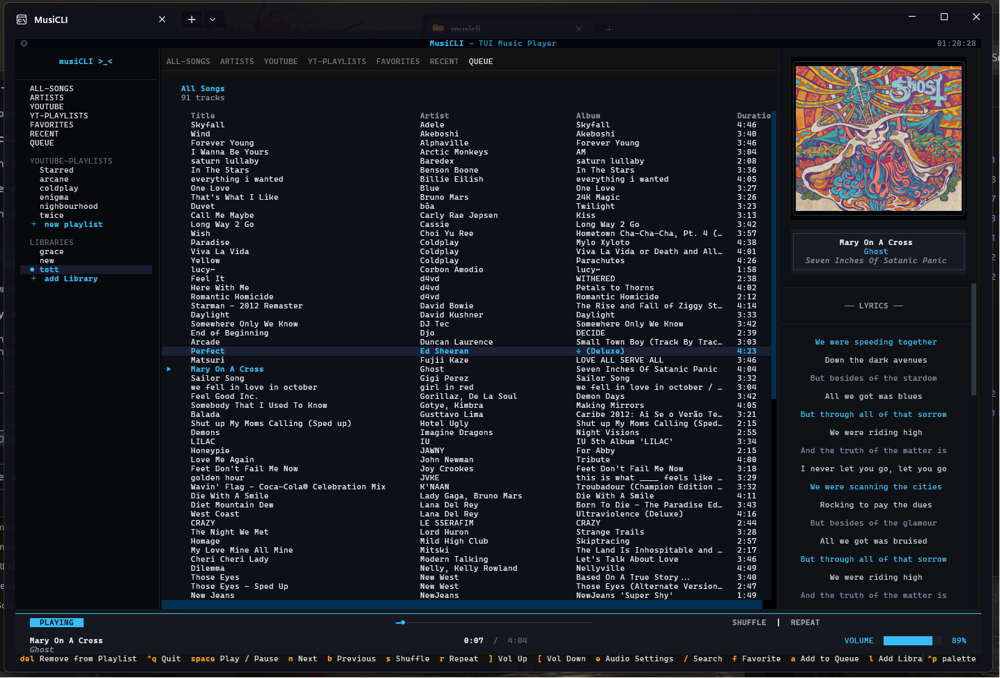
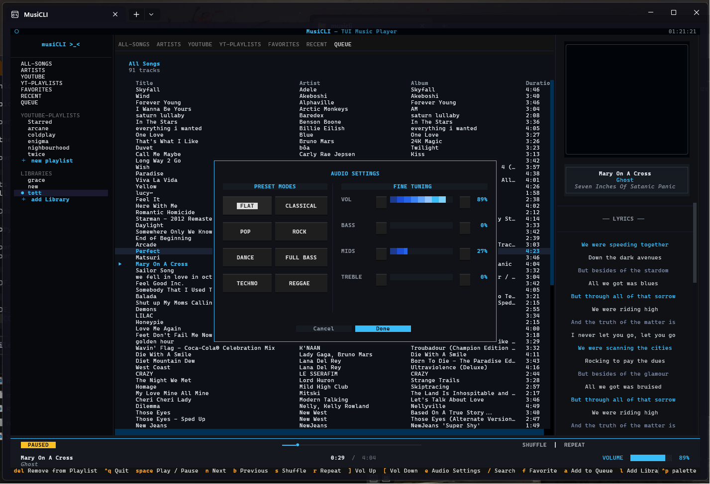
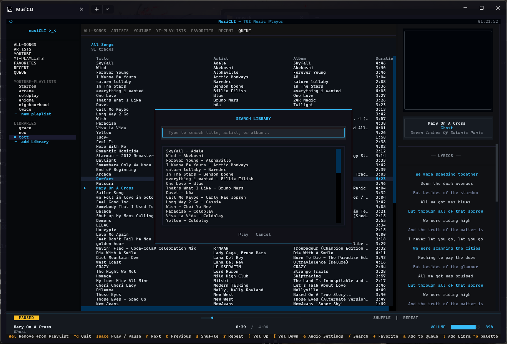
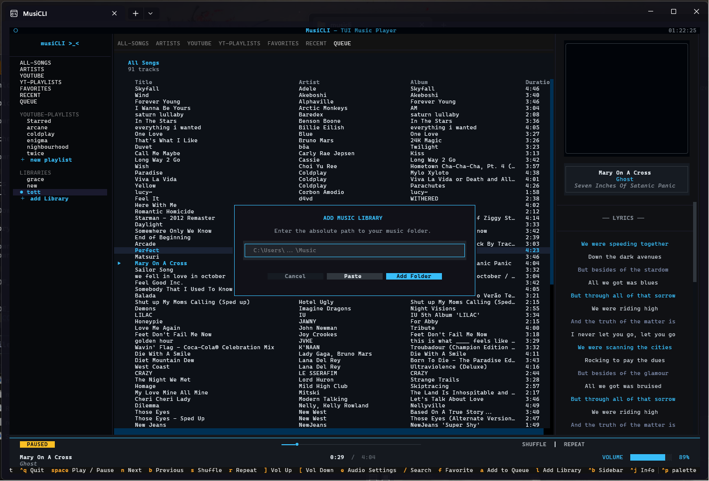

<p align="center">
  
</p>

<h1 align="center">🎵 MusiCLI</h1>

<p align="center">
  <strong>The Ultimate Terminal Music Experience</strong><br>
  A feature-rich, Spotify-inspired music player that lives in your terminal.
</p>

<p align="center">
  <a href="https://python.org"></a>
  <a href="https://github.com/tott1o/musiCLI"></a>
  <a href="LICENSE"></a>
  <a href="https://textual.textualize.io/"></a>
</p>

---

**MusiCLI** is a high-performance music player designed entirely for the terminal. It combines local library management with YouTube streaming, synchronized lyrics, album art rendering, and a beautiful dark-themed interface — all controlled with your keyboard.

<p align="center">
  
</p>

---

## 📋 Table of Contents

- [Features](#-features)
- [Screenshots](#-screenshots)
- [Prerequisites](#-prerequisites)
- [Working on MusiCLI](#-working-on-musicli)
- [Getting Started](#-getting-started)
- [Usage Guide](#-usage-guide)
- [Keyboard Controls](#-keyboard-controls)
- [Configuration](#-configuration)
- [Project Structure](#-project-structure)
- [Technical Architecture](#-technical-architecture)
- [Contributing](#-contributing)
- [Troubleshooting](#-troubleshooting)
- [License](#-license)

---

## ✨ Features

### 🎧 Superior Playback
- **Hybrid Audio Engine** — `Pygame` for local files, `VLC` for streaming & broad format support
- **Full Playback Controls** — Play, pause, seek, next, previous, with smooth transitions
- **Smart Queue** — Add, remove, and reorder tracks on the fly
- **Session Resume** — Remembers your last track, playback position, and volume across sessions

### 🌐 YouTube Streaming
- **Search & Stream** — Search millions of songs on YouTube and play them instantly
- **YouTube Playlists** — Save and manage your favorite YouTube playlists
- **No Downloads Required** — Stream directly without cluttering your disk

### 🎤 Synchronized Lyrics
- **Auto-Fetch Lyrics** — Automatically fetches and displays lyrics for the current track
- **Synced Highlighting** — Current lyric line is highlighted in real-time as the song plays
- **Works for Both** — Lyrics work for local files and YouTube streams

### 📂 Library Management
- **Multi-Library Support** — Add and switch between multiple music folders
- **Artist Browsing** — Dedicated view to browse your collection by artist
- **Smart Playlists** — Automatic grouping by folder, plus Favorites and Recently Played
- **Real-Time Search** — Find any song instantly with fuzzy matching across title, artist, and album

### 🎨 Modern Terminal UI
- **Spotify-Inspired Dark Theme** — Sleek cyan-on-dark color palette
- **Tabbed Navigation** — All Songs, Artists, YouTube, Playlists, Favorites, Recent, Queue
- **Album Art** — High-quality album art rendered directly in the terminal
- **Audio Equalizer** — Built-in EQ with preset modes (Flat, Classical, Pop, Rock, Dance, etc.)
- **Responsive Layout** — Adapts to any terminal size

---

## 📸 Screenshots

### Main Player — All Songs with Synced Lyrics
Browse your entire library with metadata columns. The right panel shows album art and synced lyrics that highlight the current line.

<p align="center">
  
</p>

### YouTube Search & Streaming
Search YouTube directly from the app. Select any result to start streaming with album art and lyrics.

<p align="center">
  
</p>

### YouTube Playlists
Save your favorite YouTube searches as playlists for quick access.

<p align="center">
  
</p>

### Favorites
Mark songs with a heart. Your favorites are accessible from a dedicated tab.

<p align="center">
  
</p>

### Queue & Multi-Library
The queue tab shows your currently loaded library. Switch between multiple music folders on the fly.

<p align="center">
  
</p>

### Audio Settings / Equalizer
Built-in audio equalizer with preset modes (Flat, Classical, Pop, Rock, Dance, Full Bass, Techno, Reggae) and fine-tuning sliders for Volume, Bass, Mids, and Treble.

<p align="center">
  
</p>

### Search Library
Quickly find any song in your library with the search modal. Fuzzy matches across title, artist, and album.

<p align="center">
  
</p>

### Add Music Library
Add a new music folder by entering its absolute path. Supports multiple libraries.

<p align="center">
  
</p>

---

## 📋 Prerequisites

Before setting up MusiCLI, make sure you have:

| Requirement | Version | Purpose |
|:---|:---|:---|
| **Python** | 3.10 or higher | Runtime |
| **pip** | Latest | Package management |
| **VLC Media Player** | Any recent version | YouTube streaming & broad codec support |
| **Modern Terminal** | — | Windows Terminal, Alacritty, Kitty, iTerm2, etc. |

### Installing VLC

<details>
<summary><strong>🪟 Windows</strong></summary>

Download and install from [videolan.org/vlc](https://www.videolan.org/vlc/). Make sure VLC is in your system PATH, or install it to the default location (`C:\Program Files\VideoLAN\VLC`).
</details>

<details>
<summary><strong>🐧 Linux</strong></summary>

```bash
# Ubuntu / Debian
sudo apt install vlc

# Fedora
sudo dnf install vlc

# Arch
sudo pacman -S vlc
```
</details>

<details>
<summary><strong>🍎 macOS</strong></summary>

```bash
brew install --cask vlc
```
</details>

---

## 🛠️ Working on MusiCLI

### 1. Prerequisites

Before starting, ensure you have:
- **Python 3.10+**
- **pip**
- **VLC Media Player** (Required for streaming)

### 2. Setup

<details>
<summary><strong>🪟 Windows</strong></summary>

```bash
# 1. Clone the repository
git clone https://github.com/tott1o/musiCLI.git
cd musiCLI

# 2. Create a virtual environment
python -m venv .venv

# 3. Activate the environment (CRITICAL)
.venv\Scripts\activate

# 4. Install in editable mode
pip install -e .
```
</details>

<details>
<summary><strong>🐧 Linux / 🍎 macOS</strong></summary>

```bash
# 1. Clone the repository
git clone https://github.com/tott1o/musiCLI.git
cd musiCLI

# 2. Create a virtual environment
python -m venv .venv

# 3. Activate the environment (CRITICAL)
source .venv/bin/activate

# 4. Install in editable mode
pip install -e .
```
</details>

<details>
<summary><strong>🐧 Linux / 🍎 macOS (Using Make)</strong></summary>

If you prefer using `make` shortcuts:

```bash
git clone https://github.com/tott1o/musiCLI.git
cd musiCLI

# Setup virtual environment and install in editable mode
# (Make sure your environment is active first!)
make setup

# Run
make run
```
</details>

### 3. Running

```bash
# Launch the application
musicli

# Alternatively, if the 'musicli' command is not recognized (e.g. PATH issues):
python -m musicli.cli
```

---

## ⚡ Getting Started

<details open>
<summary><strong>🪟 Windows</strong></summary>

```bash
# Start with a music folder
musicli "C:\Users\YourName\Music"

# Resume your last session (no arguments needed!)
musicli
```
</details>

<details open>
<summary><strong>🐧 Linux / 🍎 macOS</strong></summary>

```bash
# Start with a music folder
musicli ~/Music

# Resume your last session (no arguments needed!)
musicli
```
</details>

Once launched, you'll see the main interface with your songs listed. Use the **keyboard shortcuts** below to navigate, play music, and explore features.

> **💡 Tip:** Running `musicli` without any arguments will automatically resume your last session — same track, same position, same volume.

---

## 📖 Usage Guide

### Playing Local Music

1. Launch MusiCLI with a path to your music folder:
   ```bash
   musicli ~/Music
   ```
2. Your songs are automatically scanned and displayed in the **All Songs** tab
3. Use `↑` / `↓` to browse, `Enter` or `Space` to play
4. Songs are sorted by folder (playlist). Use `1`-`4` to sort by title, artist, album, or duration

### Streaming from YouTube

1. Press the **YouTube** tab or click it in the sidebar
2. Type a search query in the search bar and press **Search**
3. Select any result to start streaming — album art and lyrics load automatically
4. Press `A` to add a YouTube track to your queue

### Managing Playlists

- **YouTube Playlists**: Save YouTube search results as named playlists via the **YT-Playlists** tab
- **Favorites**: Press `F` on any track to heart/un-heart it. View all favorites in the **Favorites** tab
- **Recently Played**: The **Recent** tab tracks your listening history (up to 50 songs)

### Adding Multiple Libraries

1. Press `L` to open the **Add Library** modal
2. Enter the absolute path to another music folder
3. Switch between libraries using the **Libraries** section in the sidebar

### Using the Equalizer

1. Press `E` to open **Audio Settings**
2. Choose a preset mode (Flat, Classical, Pop, Rock, Dance, Full Bass, Techno, Reggae)
3. Or fine-tune Volume, Bass, Mids, and Treble with the sliders
4. Press **Done** to apply

### Searching Your Library

1. Press `/` to open the **Search** modal
2. Type any part of a song title, artist name, or album
3. Results update in real-time with fuzzy matching
4. Press `Enter` to play the selected result

---

## ⌨️ Keyboard Controls

### Core Playback

| Key | Action |
|:---|:---|
| `Space` | **Play / Pause** |
| `N` | **Next** track |
| `B` | **Previous** track |
| `→` / `←` | **Seek** forward / backward (5 seconds) |
| `]` / `[` | **Volume** up / down |

### Navigation

| Key | Action |
|:---|:---|
| `↑` / `↓` | Move through track list |
| `Enter` | Play selected track |
| `Tab` | Switch between tabs |

### Modes & Features

| Key | Action |
|:---|:---|
| `S` | Toggle **Shuffle** |
| `R` | Cycle **Repeat** mode (Off → All → One) |
| `/` | Open **Search** |
| `F` | Toggle **Favorite** ♥ |
| `A` | **Add to Queue** |
| `L` | **Add Library** / Switch music root |
| `E` | Open **Audio Settings** / Equalizer |

### Sorting (Local Library)

| Key | Action |
|:---|:---|
| `1` | Sort by **Title** |
| `2` | Sort by **Artist** |
| `3` | Sort by **Album** |
| `4` | Sort by **Duration** |

### Other

| Key | Action |
|:---|:---|
| `^Q` | **Quit** the application |
| `^B` | Toggle **Sidebar** |
| `^P` | Toggle **Command Palette** |
| `Del` | Remove from playlist |

---

## ⚙️ Configuration

### Environment Variables

MusiCLI uses a `.env` file in the project root for configuration. Copy the example file to get started:

```bash
cp .env.example .env
```

| Variable | Description | Example |
|:---|:---|:---|
| `YOUTUBE_COOKIES_FROM_BROWSER` | Browser to extract YouTube cookies from (fixes bot detection) | `chrome`, `firefox`, `edge` |
| `YOUTUBE_COOKIES_FILE` | Path to a `cookies.txt` file (Netscape format) | `./cookies.txt` |

### Supported Audio Formats

MusiCLI supports the following local audio formats:

`.mp3` · `.ogg` · `.wav` · `.flac` · `.m4a` · `.aac` · `.wma` · `.opus`

### Data Storage

MusiCLI stores persistent data (state, cache, downloads) in:

| OS | Path |
|:---|:---|
| Windows | `%USERPROFILE%\.musicli\` |
| Linux / macOS | `~/.musicli/` |

This includes:
- `state.json` — Session state (last track, position, volume, favorites, recent)
- `temp/` — Temporary audio conversions
- `youtube_downloads/` — Cached YouTube streams

---

## 🏗️ Project Structure

```
musiCLI/
├── .github/                    # GitHub templates & CI
│   ├── ISSUE_TEMPLATE/
│   │   ├── bug_report.md
│   │   └── feature_request.md
│   ├── PULL_REQUEST_TEMPLATE.md
│   └── workflows/
│       └── ci.yml              # Lint + test on push/PR
├── docs/
│   └── images/                 # Screenshots & logo
├── src/
│   └── musicli/                # Main package (src-layout)
│       ├── __init__.py         # Package metadata & version
│       ├── __main__.py         # `python -m musicli` entry point
│       ├── app.py              # Main Textual application
│       ├── cli.py              # CLI argument parsing
│       ├── config.py           # Configuration constants
│       ├── models.py           # Data models (Song, Playlist)
│       ├── notifications.py    # Toast notifications
│       ├── player.py           # Audio playback engine
│       ├── scanner.py          # Music folder scanner
│       ├── state.py            # Persistent state manager
│       ├── theme.py            # UI theme & styles
│       ├── utils.py            # Utility functions
│       └── widgets/            # Textual UI widgets
│           ├── album_art.py
│           ├── artist_panel.py
│           ├── now_playing.py
│           ├── queue_panel.py
│           ├── search_modal.py
│           ├── sidebar.py
│           ├── track_list.py
│           ├── youtube_panel.py
│           └── ... (modals & panels)
├── tests/                      # Test suite
│   └── test_models.py
├── .env.example                # Environment variable template
├── .gitignore
├── LICENSE                     # MIT License
├── Makefile                    # Dev shortcuts
├── pyproject.toml              # Build config & dependencies (PEP 621)
├── README.md                   # ← You are here
└── requirements.txt            # Legacy dependency file
```

---

## 🔧 Technical Architecture

MusiCLI is built with a modular architecture focused on performance and reliability:

| Component | Technology | Purpose |
|:---|:---|:---|
| **Frontend** | [Textual](https://textual.textualize.io/) | Powerful TUI framework for Python |
| **Local Playback** | [Pygame Mixer](https://www.pygame.org/docs/ref/mixer.html) | Low-latency local audio playback |
| **Streaming** | [Python-VLC](https://pypi.org/project/python-vlc/) | Reliable streaming & broad format support |
| **Metadata** | [TinyTag](https://pypi.org/project/tinytag/) | Lightning-fast audio metadata reading |
| **YouTube** | [yt-dlp](https://github.com/yt-dlp/yt-dlp) | Industry-standard YouTube extraction |
| **Lyrics** | [syncedlyrics](https://pypi.org/project/syncedlyrics/) | Synced lyrics fetching |
| **Images** | [Pillow](https://python-pillow.org/) + [textual-image](https://pypi.org/project/textual-image/) | Album art rendering |

---

## 🐛 Troubleshooting

<details>
<summary><strong>🔇 No sound?</strong></summary>

- Ensure **VLC Media Player** is installed on your system
- Check that your system volume isn't muted
- On Linux, make sure PulseAudio/PipeWire is running
</details>

<details>
<summary><strong>🔍 YouTube search failing?</strong></summary>

- Update yt-dlp to the latest version:
  ```bash
  pip install -U yt-dlp
  ```
</details>

<details>
<summary><strong>🤖 "Sign in to confirm you're not a bot" error?</strong></summary>

YouTube has increased bot detection. To fix this:

1. Copy the example env file:
   ```bash
   cp .env.example .env
   ```
2. Edit `.env` and set your browser:
   ```
   YOUTUBE_COOKIES_FROM_BROWSER=chrome
   ```
   Supported: `chrome`, `firefox`, `edge`, `opera`, `brave`, `vivaldi`, `safari`

3. This allows MusiCLI to use your browser's login session for YouTube authentication.
</details>

<details>
<summary><strong>🖥️ UI looks broken or weird?</strong></summary>

- Use a **modern terminal** emulator:
  - **Windows**: Windows Terminal (recommended)
  - **macOS**: iTerm2, Alacritty, or Kitty
  - **Linux**: Alacritty, Kitty, or GNOME Terminal
- Install a **Nerd Font** (e.g., [JetBrains Mono Nerd Font](https://www.nerdfonts.com/)) for proper icon rendering
- Ensure your terminal supports **24-bit (true color)**
</details>

<details>
<summary><strong>📦 Import errors?</strong></summary>

- Make sure you installed the package correctly:
  ```bash
  pip install -e .
  ```
- If using a virtual environment, make sure it's activated
- Try reinstalling:
  ```bash
  pip uninstall musicli && pip install -e .
  ```
</details>

---

## 📄 License

Distributed under the **MIT License**. See [`LICENSE`](LICENSE) for more information.

---

<p align="center">
  Made with ❤️ by <a href="https://github.com/tott1o">tott1o</a>
</p>

<p align="center">
  <a href="#-musicli">⬆ Back to top</a>
</p>
